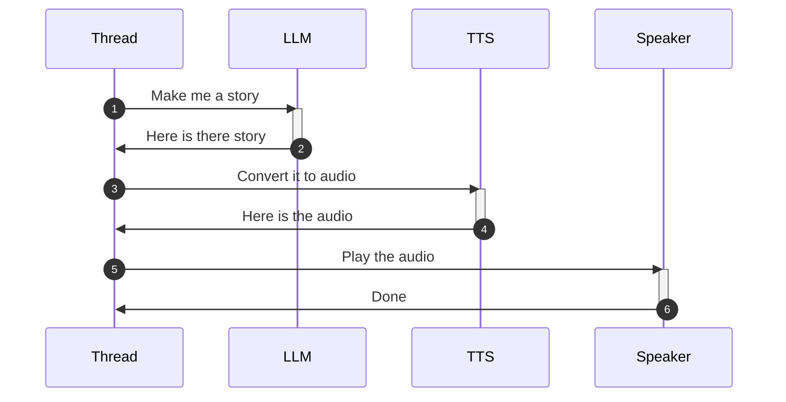
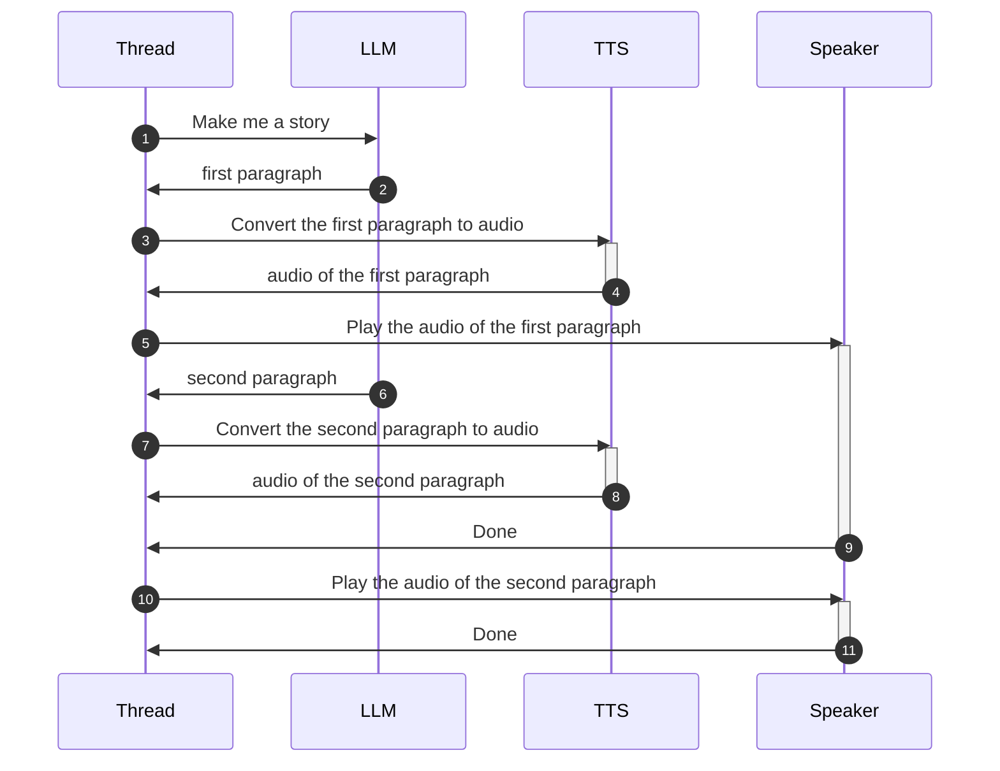

# Fably

Use AI to generate and tell bedtime stories to kids.

Run it on your computer or on very cheap (<50$) hardware.


Watch Fably running on a Raspberry PI Zero 2W below:

[](https://www.youtube.com/watch?v=zILPuh84OcY "Fably running on a Raspberry PI Zero 2W")

## Installation

All you need to get started is a computer (doesn't matter which operating system) with:

* python installed
* git installed
* a speaker

type this into your command line

```sh
git clone https://github.com/stefanom/fably.git
cd fably
pip install --editable .
```

### Listening to examples

In the `example` folder, there are several examples of generated stories along with the synthetized speech. You can listen to them directly here from github or you can run the following command to run use Fably itself to tell the story already generated

```sh
fably --stories-path=examples/openai_expensive "Tell me a story about a princess and a frog" 
```

will play a story that's already generated. Look in the [examples](https://github.com/stefanom/fably/tree/main/fably/examples) folder to see which other stories can be told without requiring an OpenAI key.

### Setting up the OpenAI Key

To enable Fably to tell new stories, we need an OpenAI API key. Go to https://platform.openai.com/api-keys to obtain one.

NOTE: OpenAI might require you to enter a credit card to obtain an API key. You will be responsible to pay for the usage of these computationally demanding API calls.

Once you have the key run this command in Windows

```sh
copy env.example .env
```

or this command in MacOS/Linux

```sh
cp env.example .env
```

and add your OpenAI key in that file.

### Telling a new story

For this, we'll need to have a microphone available to our computer. Run this command to have fably listen to your voice query and tell you a story:

```bash
fably 
```

Once Fably is done introducing itself, say out loud "tell me a story about a dog" (or whatever story you want. Just make sure to start with "tell me a story" as Fably will not repsond to any other query) and let Fably do its magic.

## Installing on a RaspberryPI

We will need:

* a Raspberry Pi (at least a Zero 2w)
* a mic hat (as the zero doesn't a mic nor USB ports). I tried it with both these sounds cards:
  * [ReSpeaker HAT](https://wiki.seeedstudio.com/ReSpeaker_2_Mics_Pi_HAT/)
  * [WM8960 Audio HAT](https://www.waveshare.com/wm8960-audio-hat.htm)
* a power supply
* a wired speaker

### Phase 1 - Install Raspian on the rPI

To install the OS we recommend using the official installer located at https://www.raspberrypi.com/software/.

The best choice is the "Raspberry Pi OS (legacy, 64-bit) Lite" which contains the bare minimum to get us going but consumes the least amount of resources and contains the minimum amount of attack surface.

Make sure to follow the advanced options that allow us to setup our rpi with things like hostname, wifi password and enable the ssh server so that we don't need keyboards and monitors to connect to it, we can just do it from our regular computer.

Once we are able to ssh into the device, we're ready for the next step.

### Phase 2 - Update the OS installation

Log into the RPI via SSH and type

```bash
sudo apt update
sudo apt upgrade -y
sudo reboot
```

Rebooting is not needed every time but it's safer in case the Linux kernel has been upgraded.

### Phase 3 - Install the stuff that Fably needs

Log into the RPI via SSH and type

```bash
sudo apt install -y \
    git \
    mpg123 \
    libportaudio2 \
    libsndfile1 \
    python3-venv \
    python3-pip \
    python3-scipy \
    python3-numpy \
    python3-pydub \
    python3-gpiozero \
    python3-bluez
```

When this is done, create a python environment for Fably (the Raspberry OS is very picky about not letting you install pip without using virtual environments for Python):

```bash
python -m venv --system-site-packages .venv
source .venv/bin/activate
```

### Phase 4 - Install Fably

Type

```bash
git clone git@github.com:stefanom/fably.git
cd fably
pip install --editable .
```

and make sure that Fably works as intended by typing

```bash
fably --help
```

### Phase 5 - Configure the OpenAPI api key

If you haven't done so already, go to https://platform.openai.com/api-keys to obtain your API key.

```bash
cp env.example .env
echo <your_api_key> >> .env
```

### Phase 6.a - Install drivers for the [ReSpeaker HAT](https://wiki.seeedstudio.com/ReSpeaker_2_Mics_Pi_HAT/)

Skip this section if that's not the sound card that you have.

First we download the source code for the HAT drivers

```bash
git clone https://github.com/HinTak/seeed-voicecard
cd seeed-voicecard
```

then we switch to the git branch of the kernel we're currently using

```bash
uname_r=$(uname -r)
version=$(echo "$uname_r" | sed 's/\([0-9]*\.[0-9]*\).*/\1/')
git checkout v$version
```

at this point we're ready to make the driver, install it and reboot

```bash
sudo ./install.sh
sudo reboot
```

Then log back into the RPI after it reboots and then type

```bash
arecord -l
```

and we should see something like this

```txt
**** List of CAPTURE Hardware Devices ****
card 3: seeed2micvoicec [seeed-2mic-voicecard], device 0: fe203000.i2s-wm8960-hifi wm8960-hifi-0 [fe203000.i2s-wm8960-hifi wm8960-hifi-0]
  Subdevices: 1/1
  Subdevice #0: subdevice #0
```

we can test the card by playing a sound like this

```bash
aplay /usr/share/sounds/alsa/Front_Center.wav
```

### Phase 6.b - Install drivers for the [WM8960 Audio HAT](https://www.waveshare.com/wm8960-audio-hat.htm)

Skip this section if that's not the sound card that you have.

First we download the source code for the HAT drivers

```bash
git clone https://github.com/waveshare/WM8960-Audio-HAT
cd WM8960-Audio-HAT
```

then we build and install the drivers

```bash
sudo ./install.sh
sudo reboot
```

Then log back into the RPI after it reboots and then type

```bash
sudo dkms status
```

and we should be seeing something like this:

```txt
wm8960-soundcard, 1.0, 4.19.58-v7l+, armv7l: installed
```

then typing

```bash
arecord -l
```

and we should be seeing something like this

```txt
**** List of CAPTURE Hardware Devices ****
card 0: wm8960soundcard [wm8960-soundcard], device 0: bcm2835-i2s-wm8960-hifi wm8960-hifi-0 []
  Subdevices: 1/1
  Subdevice #0: subdevice #0
```

we can test the card by playing a sound like this

```bash
aplay /usr/share/sounds/alsa/Front_Center.wav
```

### Phase 7 - Make Fably start when the RPI starts

```bash
sudo cp ./install/rpi/fably.service /etc/systemd/system/fably.service
sudo systemctl enable fably.service
sudo reboot
```

Your RPI should start by speaking to you!

## Getting it to work with locally hosted models

WARNING: this is new functionality that is not well tested yet! Use at your own risk!

If we want to use Fably with locally hosted models (for costs or privacy reasons or both), we can do so by following these steps.

1. Install [Ollama](https://ollama.com/)
2. Download whatever model we want (I'd suggest to start with [LLama3:7b](https://ollama.com/library/llama3) to try it out)
3. Pass the URL to Ollama's endpoint as a parameter to Fably with `--llm-url` when [starting it](https://github.com/stefanom/fably/blob/main/startup/start_fably.sh).
4. Make sure that the Ollama endpoint is accessible from the RPI.

CAUTION: Ollama default host is 127.0.0.1 which means it will only respond to requests coming from the same machine. We need to change `OLLAMA_HOST` environment to be `0.0.0.0` instead to imply that it should respond to requests coming from other machines as well.

## Having Fably staying up-to-date

Here is how you can automate Fably staying up to date with the latest security patches and bug fixes.

1. Install `unattended-upgrades` package:

   ```bash
   apt install unattended-upgrades
   ```

2. Add Raspberry Pi Foundation sources to `unattended-upgrades` config:

   ```conf
    # /etc/apt/apt.conf.d/50unattended-upgrades
    
    Unattended-Upgrade::Origins-Pattern {
        ...
        "origin=Raspbian,codename=${distro_codename},label=Raspbian";
        "origin=Raspberry Pi Foundation,codename=${distro_codename},label=Raspberry Pi Foundation";
    };
   ```

3. After `unattended-upgrades` logs are produced, you can verify the new sources are picked up for updates in `/var/log/unattended-upgrades/unattended-upgrades.log`.

## Under the hood

This section contains information on how Fably works.

The most naive implementation would chain the calls to the cloud API calls like this:



But this would be a terrible experience because of the very high latency: it would take a long time (potentially minutes!) before the kid hears anything coming out of the speaker. They would likely lose interest or think it's broken and call their parents. Clearly, the opposite of what we would want with a tool like this.

Luckily, modern GenAI cloud API offer a "streaming" option that allows us to receive content as soon as it's generated. With that, and the help of some asynchronous programming, we can turn the program sequence into something like this



in which we are able to send the audio to the TTS service before the LLM service has finished executing. This saves time because we can start processing the audio while the rest of the story is being generated.

There are more things we need to consider though:

* a text-to-speech model works better if it has complete sentences to work with. It needs to read ahead to understand where to put enphasis. We could, conceivably, send individual words to it but the quality of the synthetized speech would be much worse and likely incur in a lot of network overhead. One happy medium is to stream enough content to obtain a paragraph and then send that out as our unit of discourse. It increases the "time to first sound" a little but it results in much better quality of the resulting audio.
* high quality text-to-speech services are computational expensive and OpenAI greatly limits the number of concurrent requests coming from the same organization (3 in one minute, at the time of writing). This means that we can't just fire new TTS requests each time we get a new paragraph: we need to gate the number of concurrent TTS requests in flight.

Luckily for us, high quality TTS audio is generally well enunciated and that takes time to play back. This give us plenty of time to obtain a new paragraph and send it off to the TSS service before the previous one has finished playing. This gives the listener the perception of a quick response and no pauses between paragraphs, even if the components of the audio stream are being assembled in flight behind the scenes.

## Roadmap

### Short term

* make sure that it works with the WM8960 Audio HAT
* make the query guard system more sophisticated
* look into ways to make the stories more divergent (is increasing temp enough?)

### Longer term

* get it to work on ESP32-based boards
* get it to work with other AI cloud APIs
