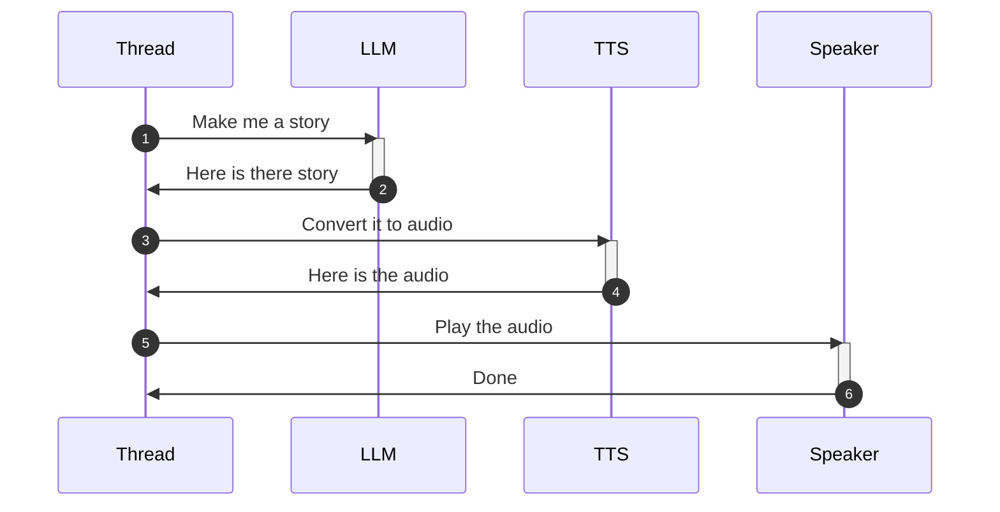
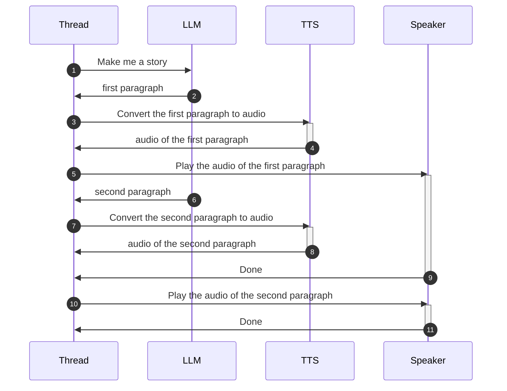

# Fably

Use AI to generate and tell bedtime stories to kids.

Run it on your computer or on very cheap (<30$) hardware.


## Installation

All you need to get started is a computer (doesn't matter which operating system) with:

* python installed
* git installed
* a speaker

type this into your command line

```sh
git clone git@github.com:stefanom/fably.git
cd fably
pip install -r requirements.txt
```

### Listening to examples

In the `example` folder, there are several examples of generated stories along with the synthetized speech. You can listen to them directly here from github or you can run the following command to run use Fably itself to tell the story already generated

```sh
python fably.py --query "Tell me a story about a princess and a frog" --stories-home=./examples/openai_cheap
```

will play the example from `openai_cheap` which uses GPT-3.5 and TTS-1 as the LLM and TTS model respectively. If you change the above to `openai_expensive`, it will play the example from `openai_expensive` which used GPT-4 and TTS-1-HD instead.

### Setting up the OpenAI Key

Go to https://platform.openai.com/api-keys and obtain a new API key.

Then run this command in Windows

```sh
copy env.example .env
```

or this command in MacOS/Linux

```sh
cp env.example .env
```

and add your OpenAI key in that file.

### Creating a story

For this, we'll need to have a microphone available to our computer. Once a microphone is available, run this command to create a story and listen to it:

```bash
python fably.py 
```

Say out loud "tell me a story about a dog" and ear the magic.

## Troubleshooting

We'll add more content here as we run into issues.

## Installing on a RaspberryPI Zero 2W

We will need:

* a Raspberry Pi Zero 2w
* a mic hat (as the zero doesn't a mic nor USB ports)
* a power supply
* a bluetooth speaker

### Step 1 - Install Raspian on the rPI

To install the OS we recommend using the official installer located at https://www.raspberrypi.com/software/.

The best choice is the "Raspberry Pi OS (legacy, 64-bit) Lite" which contains the bare minimum to get us going but consumes the least amount of resources and contains the minimum amount of attack surface.

Note that you can press "Ctrl+Shift+X" to open the advanced options that allow you to setup your device with things like hostname, ssh and wifi password. See https://kevinhaffner.blogspot.com/2021/06/hidden-settings-in-raspberry-pi-imager.html for more details.

Once you are able to ssh into the device, you're ready for the next step.

### Step 2 - Install Fably into the rPI

Log into the rPI via SSH and type

```bash
sudo apt install git -y
git clone https://github.com/stefanom/fably
cd fably
./setup.sh
```

### Step 3 - Configure OpenAPI api key

```bash
cp env.example .env
echo <your_api_key> >> .env
```

and make sure Fably works as intended

```bash
.python/bin/python fably.py --help
```

... more later ...

## Technical Details

The most naive implementation would chain the calls to the cloud API calls like this:



But this would be a terrible experience because of the very high latency: it would take a long time (potentially minutes!) before the kid hears anything coming out of the speaker. They would likely lose interest or think it's broken and call their parents. Clearly, the opposite of what we would want with a tool like this.

Luckily, modern GenAI cloud API offer a "streaming" option that allows us to receive content as soon as it's generated. With that, and the help of some asynchronous programming, we can turn the program sequence into something like this



in which we are able to send the audio to the TTS service before the LLM service has finished executing. This saves time because we can start processing the audio while the rest of the story is being generated.

There are more things we need to consider though:

* a text-to-speech model works better if it has complete sentences to work with. It needs to read ahead to understand where to put enphasis. We could, conceivably, send individual words to it but the quality of the synthetized speech would be much worse and likely incur in a lot of network overhead. One happy medium is to stream enough content to obtain a paragraph and then send that out as our unit of discourse. It increases the "time to first sound" a little but it results in much better quality of the resulting audio.
* high quality text-to-speech services are computational expensive and OpenAI greatly limits the number of concurrent requests coming from the same organization (3 in one minute, at the time of writing). This means that we can't just fire new TTS requests each time we get a new paragraph: we need to gate the number of concurrent TTS requests in flight.

Luckily for us, high quality TTS audio is generally well enunciated and that takes time to play back. This give us plenty of time to obtain a new paragraph and send it off to the TSS service before the previous one has finished playing. This gives the listener the perception of a quick response and no pauses between paragraphs, even if the components of the audio stream are being assembled in flight behind the scenes.
