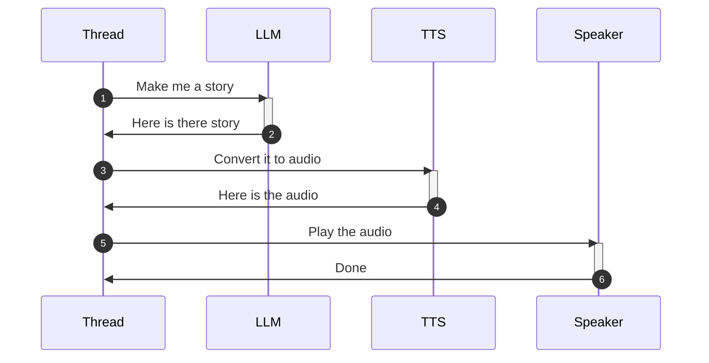
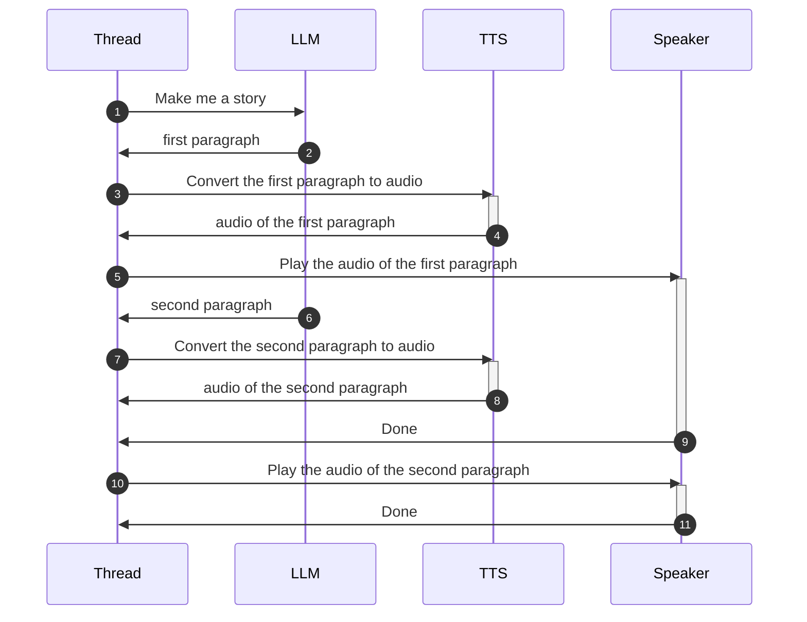

# Technical Details

## Sequence Digrams

The most naive implementation would chain the calls to the cloud API calls like this:

But this would be a terrible experience because of the very high latency: it would take a long time (potentially minutes!) before the kid hears anything coming out of the speaker. They would likely lose interest or think it's broken and call their parents. Clearly, the opposite of what we would want with a tool like this.

Luckily, modern GenAI cloud API offer a "streaming" option that allows us to receive content as soon as it's generated. With that, and the help of some asynchronous programming, we can turn the program sequence into something like this

in which we are able to send the audio to the TTS service before the LLM service has finished executing. This saves time because we can start processing the audio while the rest of the story is being generated.

There are more things we need to consider though:

* a text-to-speech model works better if it has complete sentences to work with. It needs to read ahead to understand where to put enphasis. We could, conceivably, send individual words to it but the quality of the synthetized speech would be much worse and likely incur in a lot of network overhead. One happy medium is to stream enough content to obtain a paragraph and then send that out as our unit of discourse. It increases the "time to first sound" a little but it results in much better quality of the resulting audio.
* high quality text-to-speech services are computational expensive and OpenAI greatly limits the number of concurrent requests coming from the same organization (3 in one minute, at the time of writing). This means that we can't just fire new TTS requests each time we get a new paragraph: we need to gate the number of concurrent TTS requests in flight.

Luckily for us, high quality TTS audio is generally well enunciated and that takes time to play back. This give us plenty of time to obtain a new paragraph and send it off to the TSS service before the previous one has finished playing. This gives the listener the perception of a quick response and no pauses between paragraphs, even if the components of the audio stream are being assembled in flight behind the scenes.
